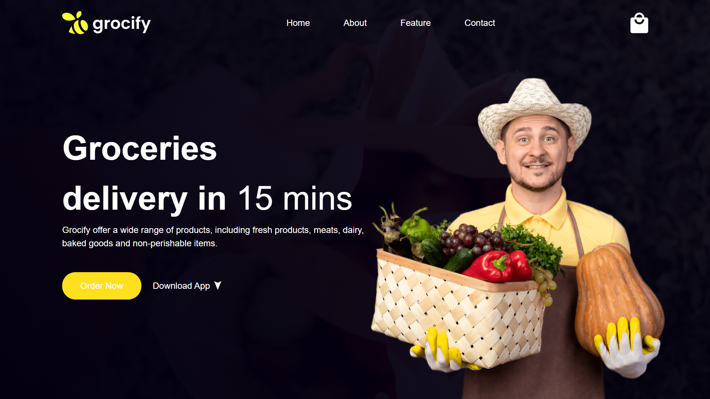

# Grocify Tailwind Landing Page 🥦

A modern and responsive landing page for **Grocify**, built using **HTML** and **Tailwind CSS**.  
This project showcases a clean grocery e-commerce UI with mobile-first responsive design.

> **“Fresh groceries, faster than ever.”**  
> _Delivering essentials to your doorstep with speed and simplicity._

---

## 🚀 Features

- Fully responsive layout using Tailwind CSS
- Hero section with catchy heading and CTA
- Product/service highlight cards
- Clean and minimal design
- Mobile-first approach

---

## 📸 Screenshots



---

## 🛠️ Tech Stack

- HTML5
- Tailwind CSS v3+

---

## 📂 Folder Structure

/ ├── index.html ├── /images └── /css (optional if using external stylesheet)

---

## 📌 Setup Instructions

1. Clone the repository  
   ```bash
   git clone https://github.com/your-username/grocify-tailwind-landing.git
   
2. Open index.html in your browser   
Or use Live Server in VS Code for live preview.

---

##✨ Credits
UI concept inspired by modern grocery delivery platforms.
Created by Akhil Soni
